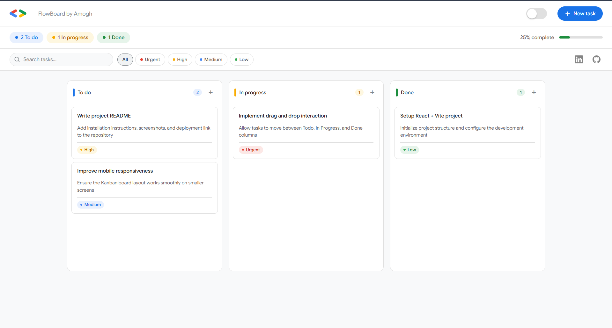
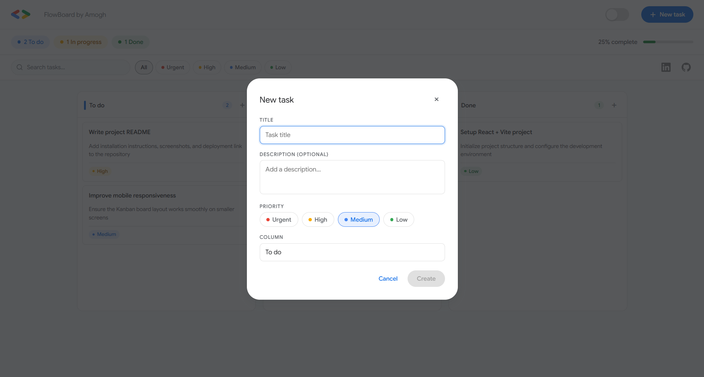
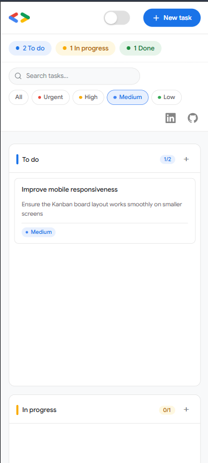
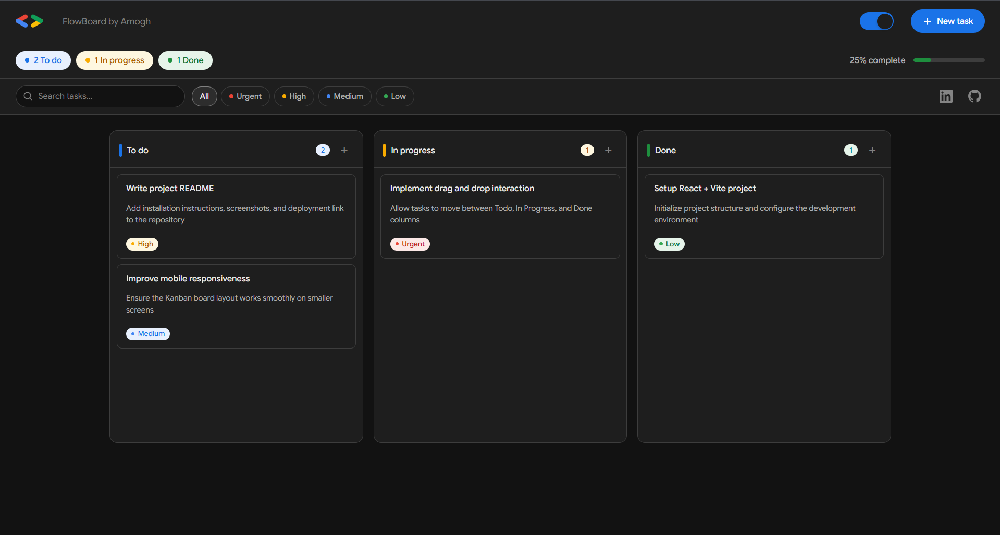

# FlowBoard

**FlowBoard: Visual Task Management, Simplified**

FlowBoard is a modern **Kanban-style task management web application** that helps users organize work visually across workflow stages.

Users can create tasks, move them between columns, assign priorities, and track progress — all within a clean and responsive interface.

This project demonstrates **React state management, drag-and-drop interactions, responsive UI design, and persistent client-side storage**.

---

## Live Demo

Explore the FlowBoard experience:

🔗 https://your-vercel-link-here.vercel.app

This is a production-ready frontend project demonstrating a clean and modern Kanban workflow.

---

## Key Features

**Kanban Board Workflow**  
Tasks are organized across three workflow stages:

- Todo
- In Progress
- Done

Users can move tasks between columns using **drag and drop interactions**.

---

**Task Management**

- Create new tasks
- Edit existing tasks
- Delete tasks
- Assign task priority levels

---

**Priority Labels**

Tasks support priority tags:

- Urgent
- High
- Medium
- Low

These help visually organize important work.

---

**Search & Filtering**

Users can:

- Search tasks by title or description
- Filter tasks by priority

This improves usability when managing larger task lists.

---

**Persistent Storage**

FlowBoard uses **localStorage** to save the board state.

This ensures that tasks remain available even after refreshing the page.

---

**Progress Indicator**

A dynamic progress bar displays the **percentage of completed tasks**, giving users quick visual feedback on workflow progress.

---

**Responsive Design**

FlowBoard adapts seamlessly across:

- Desktop
- Tablets
- Mobile devices

The layout automatically adjusts to maintain usability on smaller screens.

---

## Tech Stack

- **React** — UI architecture and state management
- **Vite** — Fast development server and build tool
- **JavaScript (ES6+)** — Application logic
- **HTML5** — Semantic structure
- **CSS3** — Responsive layouts, animations, and styling

---

## Application Architecture

The Kanban board state is managed using **React state**.

Tasks are stored in a structured object:
{
todo: [],
inprogress: [],
done: []
}

Whenever tasks are created, edited, deleted, or moved between columns:

1. The React state updates
2. The UI re-renders automatically
3. The updated board is saved to localStorage

This ensures **fast UI updates and persistent data storage**.

---

## Core Functionality

FlowBoard demonstrates several important frontend engineering concepts:

- React functional components
- Component-based UI architecture
- State management with `useState`
- Drag and drop interactions using native browser APIs
- Immutable state updates
- Client-side persistence with `localStorage`

---

## Purpose & Vision

This project was built to:

1. Demonstrate strong **frontend engineering skills**
2. Showcase **React-based UI architecture**
3. Implement **real-world product-style interactions**
4. Build a clean and responsive productivity interface

FlowBoard represents a **production-quality frontend project** similar to task management tools used in real development workflows.

---

## Preview

### Kanban Board

The main interface displays tasks across Todo, In Progress, and Done columns.

---

### Task Creation & Editing

Users can create tasks, assign priorities, and update task details through a modal interface.

---

### Responsive Layout

FlowBoard adapts smoothly across different screen sizes.

---

### Dark Mode

FlowBoard also supports dark mode for eye comfort.

---

## Author

**Amogh Teli**

GitHub  
https://github.com/teliamogh7578

LinkedIn  
https://www.linkedin.com/in/amogh-teli-649282349/

---

## License

This project was developed for the **GDG on Campus SRM Technical Domain Recruitment Task**.
